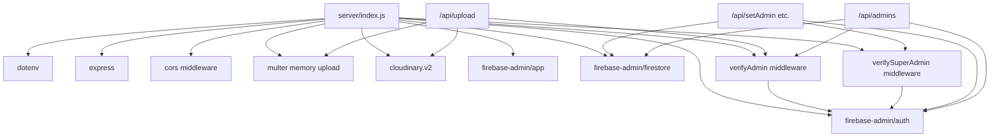
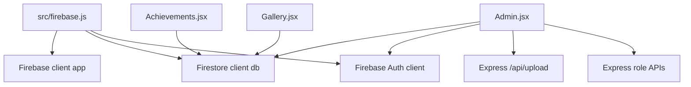
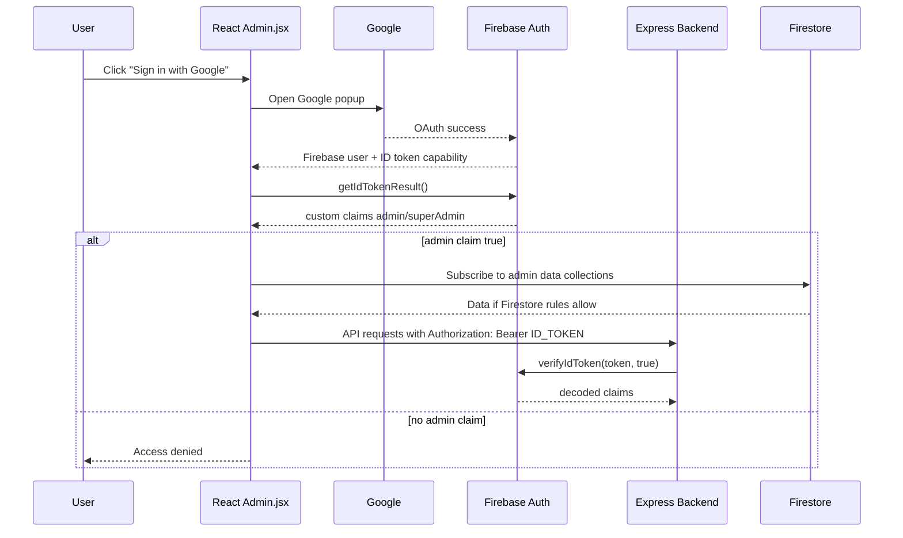
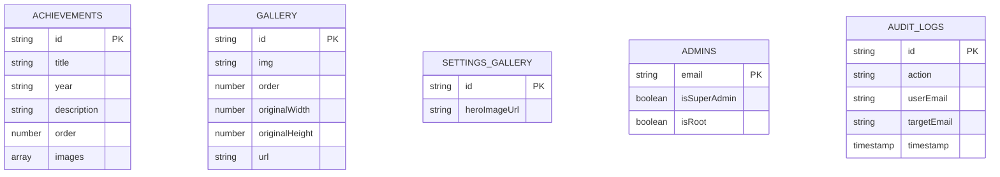
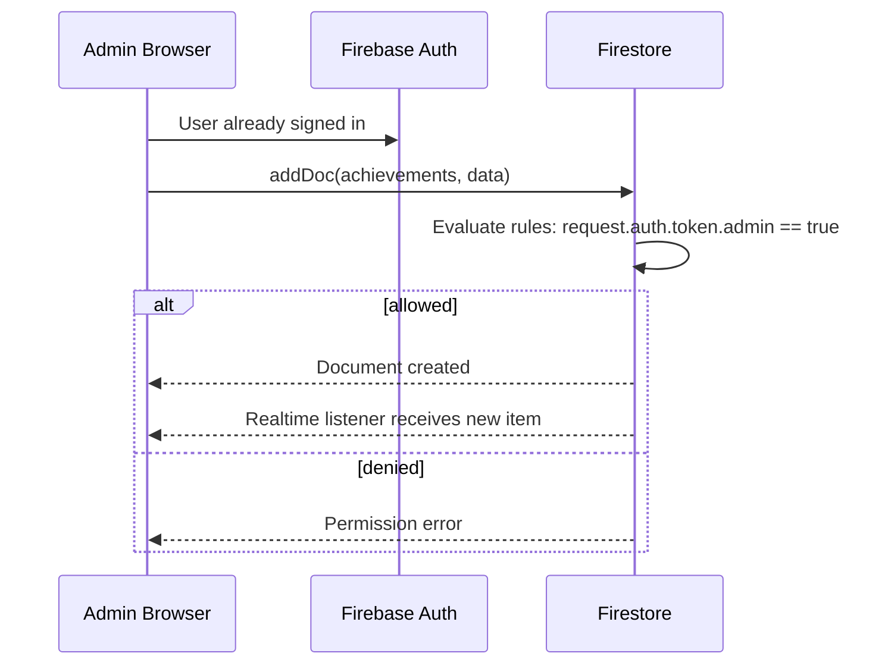
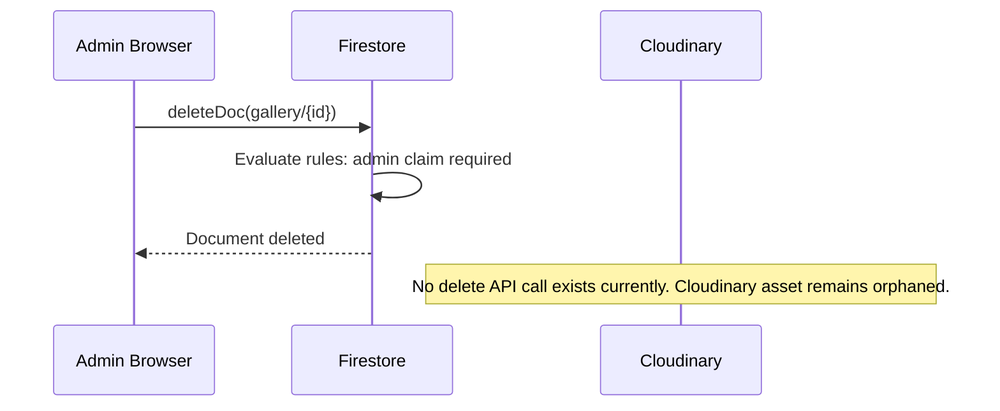
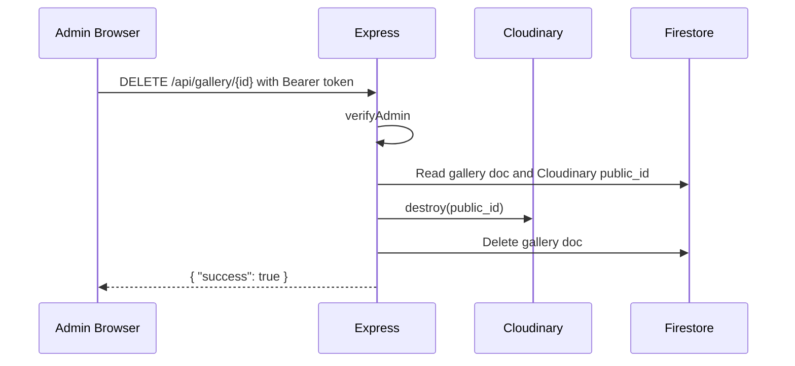
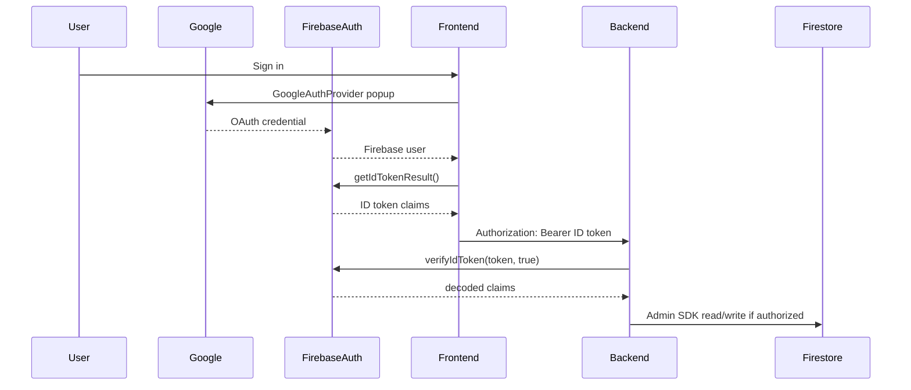
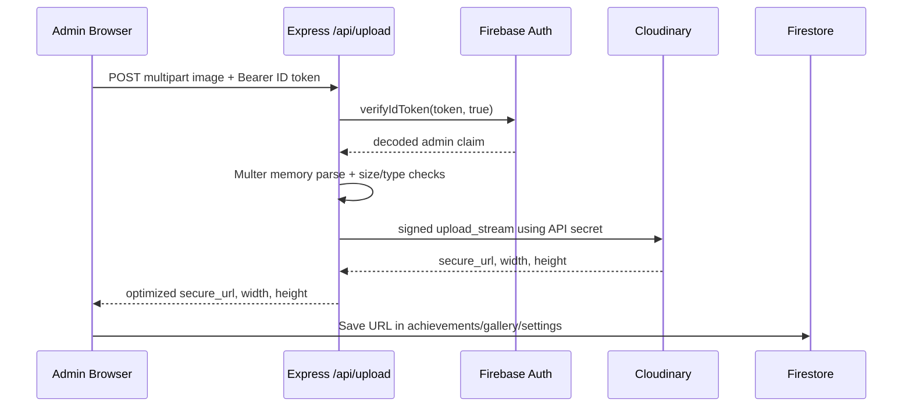
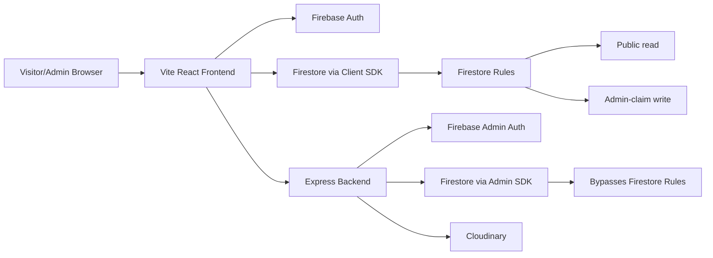

# Backend Architecture Audit

Date: 2026-06-21  
Scope: Team Rotor FPV website backend, Firebase rules, Firebase client data paths, Cloudinary upload flow, and admin authorization.

## Executive Summary

This project is a Vite/React frontend with a compact Express backend in `server/index.js`. The backend is not the only data-access layer. It handles Firebase Admin SDK initialization, admin/super-admin role management, and signed server-side Cloudinary uploads. Public reads and most content writes for `achievements`, `gallery`, and `settings/gallery` are performed directly by the React app through the Firebase client SDK, with Firestore Security Rules enforcing access.

The current trust model is:

- Browser authenticates users with Firebase Auth using Google popup sign-in.
- Browser receives Firebase ID tokens and custom claims.
- Express verifies ID tokens for role management and media upload endpoints.
- Firestore rules verify ID token claims for direct client-side content writes.
- Firebase Admin SDK bypasses Firestore rules for backend writes to `admins` and `audit_logs`.
- Cloudinary credentials stay server-side; uploads are signed through the backend.

Main security posture: much stronger than a fully client-side upload/admin model, but still missing centralized validation, rate limiting, Cloudinary delete cleanup, and formal route/module boundaries.

## Project Structure

```text
Team-RotorFPV-Website/
|-- .env                         -> Frontend Vite env, ignored by git. Contains VITE_FIREBASE_* and VITE_SUPER_ADMIN_EMAIL.
|-- .gitignore                   -> Ignores env files, server service account, node_modules, build output.
|-- firebase.json                -> Deploy config that points Firestore to firestore.rules.
|-- firestore.rules              -> Firestore access rules for achievements, gallery, settings; deny-all fallback.
|-- package.json                 -> Frontend package; Vite, React, Firebase client SDK.
|-- vite.config.js               -> Vite config.
|-- src/
|   |-- firebase.js              -> Initializes Firebase client SDK; exports Firestore db and Auth.
|   |-- pages/
|   |   |-- Admin.jsx            -> Admin dashboard, Google sign-in, Firestore CRUD, backend upload/admin API calls.
|   |   |-- Achievements.jsx     -> Public realtime read of achievements collection.
|   |   `-- Gallery.jsx          -> Public realtime read of gallery and settings/gallery.
|   `-- components/              -> UI-only components used by pages.
`-- server/
    |-- .env                     -> Backend env, ignored by git. Contains Cloudinary and SUPER_ADMIN_EMAIL.
    |-- index.js                 -> Main Express entry point; all backend routes, middleware, Firebase Admin, Cloudinary config.
    |-- package.json             -> Backend package; Express, Firebase Admin, Cloudinary, Multer, CORS, dotenv.
    |-- package-lock.json        -> Backend dependency lockfile.
    |-- serviceAccountKey.json   -> Local Firebase service account, ignored by git; used when FIREBASE_SERVICE_ACCOUNT is absent.
    `-- scripts/
        `-- setFirstAdmin.js     -> Bootstrap script that grants admin + superAdmin custom claims to one existing Firebase user.
```

There are currently no backend `routes/`, `middleware/`, `services/`, `controllers/`, or `utils/` directories. Those concepts are implemented inline inside `server/index.js`.

## Entry Points and Startup

### Frontend

`src/main.jsx` loads the React app. `src/firebase.js` initializes Firebase client SDK from Vite variables:

- `VITE_FIREBASE_API_KEY`
- `VITE_FIREBASE_AUTH_DOMAIN`
- `VITE_FIREBASE_PROJECT_ID`
- `VITE_FIREBASE_STORAGE_BUCKET`
- `VITE_FIREBASE_MESSAGING_SENDER_ID`
- `VITE_FIREBASE_APP_ID`

Admin API base URL is read in `Admin.jsx` from `VITE_API_URL`, with fallback to `http://localhost:3000`.

### Backend

`server/package.json` starts the backend with:

```bash
npm start
```

which runs:

```bash
node index.js
```

Startup order in `server/index.js`:

1. Import Express, CORS, Multer, Cloudinary, Firebase Admin SDK, dotenv, and filesystem helpers.
2. Run `dotenv.config()`, loading `server/.env` when started from `server/`.
3. Load Firebase service account:
   - Prefer `FIREBASE_SERVICE_ACCOUNT` JSON from env.
   - Otherwise read `server/serviceAccountKey.json`.
4. Initialize Firebase Admin SDK with `cert(serviceAccount)`.
5. Create Firestore Admin client with `getFirestore()`.
6. Create Express app.
7. Register CORS allowlist middleware.
8. Register JSON body parser.
9. Configure Cloudinary using env credentials.
10. Configure Multer memory upload with image type and size checks.
11. Define auth middleware and all routes.
12. Register Multer error handler.
13. Listen on `PORT` or `3000`.

## Environment Variables

### Frontend

| Variable | Used by | Purpose | Sensitivity |
|---|---|---|---|
| `VITE_FIREBASE_API_KEY` | `src/firebase.js` | Firebase web app config | Public identifier, not a secret by itself |
| `VITE_FIREBASE_AUTH_DOMAIN` | `src/firebase.js` | Firebase Auth domain | Public |
| `VITE_FIREBASE_PROJECT_ID` | `src/firebase.js` | Firebase project | Public |
| `VITE_FIREBASE_STORAGE_BUCKET` | `src/firebase.js` | Firebase storage bucket config | Public |
| `VITE_FIREBASE_MESSAGING_SENDER_ID` | `src/firebase.js` | Firebase web config | Public |
| `VITE_FIREBASE_APP_ID` | `src/firebase.js` | Firebase web app id | Public |
| `VITE_API_URL` | `src/pages/Admin.jsx` | Backend base URL | Public |
| `VITE_SUPER_ADMIN_EMAIL` | `.env` only observed | Not used by current inspected code | Treat as non-secret but avoid unnecessary exposure |

### Backend

| Variable | Used by | Purpose | Sensitivity |
|---|---|---|---|
| `FIREBASE_SERVICE_ACCOUNT` | `server/index.js` | Production Firebase Admin service account JSON | Secret |
| `SUPER_ADMIN_EMAIL` | `server/index.js` | Root super-admin email and fallback check | Sensitive config |
| `FRONTEND_URL` | `server/index.js` | Adds one allowed CORS origin | Public config |
| `PORT` | `server/index.js` | Server listen port | Public config |
| `CLOUDINARY_CLOUD_NAME` | `server/index.js` | Cloudinary account | Public-ish |
| `CLOUDINARY_API_KEY` | `server/index.js` | Cloudinary API key | Sensitive |
| `CLOUDINARY_API_SECRET` | `server/index.js` | Cloudinary signing secret | Secret |

## Dependency Graph



Client-side dependency graph:



## Authentication and Authorization

### Login Flow

Users log in only on the Admin page. The code uses Firebase Auth `signInWithPopup` with `GoogleAuthProvider`.



### Token Verification

Backend endpoints require:

```http
Authorization: Bearer <Firebase ID token>
```

`verifyAdmin`:

- Rejects missing or malformed bearer token with `401`.
- Calls `getAuth().verifyIdToken(token, true)`, so revoked tokens are checked.
- Requires decoded custom claim `admin === true`.
- Stores decoded token on `req.user`.

`verifySuperAdmin`:

- Same bearer-token check and revoked-token verification.
- Allows if `decodedToken.superAdmin === true` OR `decodedToken.email === SUPER_ADMIN_EMAIL`.
- Stores decoded token on `req.user`.

There are no session cookies. Authentication is stateless bearer-token auth.

### Admin Roles

Roles are Firebase Auth custom claims:

```json
{
  "admin": true,
  "superAdmin": true
}
```

The backend mirrors role state into Firestore `admins/{email}` documents for dashboard listing and migration convenience. The authoritative access decision is still the Firebase Auth custom claim.

Trust boundary:

- Browser UI checks claims for display/UX.
- Backend rechecks claims for role APIs and upload.
- Firestore rules recheck claims for direct client writes.
- Admin SDK operations bypass Firestore rules, so backend middleware is critical.

## Firebase Admin SDK Usage

Firebase Admin SDK is initialized in two places:

- `server/index.js`: production backend.
- `server/scripts/setFirstAdmin.js`: one-off bootstrap script.

Service account loading:

- Backend supports `FIREBASE_SERVICE_ACCOUNT` env JSON or local `serviceAccountKey.json`.
- Bootstrap script only reads local `server/serviceAccountKey.json`.

Admin SDK operations:

- Verify ID tokens and revocation.
- Get users by email.
- Set custom user claims.
- Revoke refresh tokens after admin/super-admin removal.
- List users during admin-list fallback migration.
- Read/write Firestore collections `admins` and `audit_logs`.

Important: Admin SDK Firestore operations bypass Firestore Security Rules. For example, `db.collection('admins').doc(email).set(...)` does not need rules permission. Therefore, `verifySuperAdmin` is the real gate for role mutation.

## Firestore Rules

Rules define:

- `achievements`: public read; admin-only create/update/delete.
- `gallery`: public read; admin-only create/update/delete.
- `settings`: public read; admin-only write.
- Everything else: denied.

Rules use:

```js
request.auth != null && request.auth.token.admin == true
```

These rules protect browser-side Firebase client writes. They do not protect backend Admin SDK writes.

## Database Architecture

Database: Cloud Firestore.

No explicit composite index config was found. The app uses single-field `orderBy('order', 'desc')` queries on `achievements` and `gallery`, which Firestore normally supports with automatic single-field indexes.



### Collection: `achievements`

Purpose: Public achievement content for the Achievements page.

Fields:

- `title`: string
- `year`: string
- `description`: string
- `order`: number
- `images`: array of URL strings

Example:

```json
{
  "title": "Aerothon 2024",
  "year": "2024",
  "description": "Competition result text",
  "order": 10,
  "images": ["https://res.cloudinary.com/.../image.webp"]
}
```

Reads:

- Public `Achievements.jsx` realtime listener.
- Admin dashboard realtime listener.

Writes:

- Admin dashboard via Firebase client SDK `addDoc`, `updateDoc`, `deleteDoc`.

### Collection: `gallery`

Purpose: Public gallery masonry images.

Fields:

- `img`: string URL
- `order`: number
- `originalWidth`: number
- `originalHeight`: number
- `url`: string, currently saved as empty string
- Legacy possibility: `height`

Example:

```json
{
  "img": "https://res.cloudinary.com/.../image.webp",
  "order": 20,
  "originalWidth": 1200,
  "originalHeight": 800,
  "url": ""
}
```

Reads:

- Public `Gallery.jsx` realtime listener.
- Admin dashboard realtime listener.

Writes:

- Admin dashboard via Firebase client SDK.

### Document: `settings/gallery`

Purpose: Stores gallery hero image URL.

Fields:

- `heroImageUrl`: string

Example:

```json
{
  "heroImageUrl": "https://res.cloudinary.com/.../hero.webp"
}
```

Reads:

- Public Gallery page.
- Admin dashboard.

Writes:

- Admin dashboard via Firebase client SDK `setDoc(..., { merge: true })`.

### Collection: `admins`

Purpose: Dashboard list/cache of admins and super admins.

Fields:

- `email`: string
- `isSuperAdmin`: boolean
- `isRoot`: boolean

Example:

```json
{
  "email": "admin@example.com",
  "isSuperAdmin": true,
  "isRoot": false
}
```

Reads:

- Backend `/api/admins` using Admin SDK.

Writes:

- Backend role routes using Admin SDK.
- `/api/admins` fallback migration can populate from Firebase Auth users.

Client access:

- Denied by Firestore rules fallback. Only backend should read/write.

### Collection: `audit_logs`

Purpose: Best-effort record of role changes.

Fields:

- `action`: string
- `userEmail`: string
- `targetEmail`: string
- `timestamp`: Date/timestamp

Example:

```json
{
  "action": "granted admin to",
  "userEmail": "root@example.com",
  "targetEmail": "new-admin@example.com",
  "timestamp": "2026-06-21T00:00:00.000Z"
}
```

Reads:

- No current UI/API reader found.

Writes:

- Backend `logAudit`.

Client access:

- Denied by Firestore rules fallback.

## Backend API Endpoints

All backend responses are JSON. All protected endpoints expect Firebase ID token bearer auth.

### `GET /api/admins`

Purpose: List current admins.

Headers:

```http
Authorization: Bearer <idToken>
```

Middleware:

- CORS
- `express.json()`
- `verifyAdmin`

Body: none. Query params: none.

Execution:

1. Request reaches Express.
2. CORS checks origin.
3. `verifyAdmin` verifies Firebase ID token with revocation check.
4. Requires custom claim `admin === true`.
5. Backend reads Firestore `admins`.
6. If not empty, returns docs as `{ admins }`.
7. If empty, lists up to 1000 Firebase Auth users, filters users with `customClaims.admin === true`, writes them to Firestore `admins` in a batch, then returns them.

Firestore/Auth operations:

- `admins.get()`
- fallback `getAuth().listUsers(1000)`
- fallback batch writes to `admins/{email}`

Success:

```json
{
  "admins": [
    { "email": "admin@example.com", "isSuperAdmin": true, "isRoot": false }
  ]
}
```

Errors:

- `401` missing/invalid/revoked token.
- `403` not admin.
- `500` list or database failure.

### `POST /api/setAdmin`

Purpose: Grant regular admin privileges to an existing Firebase Auth user.

Headers:

```http
Content-Type: application/json
Authorization: Bearer <idToken>
```

Body:

```json
{ "email": "user@example.com" }
```

Middleware:

- CORS
- `express.json()`
- `verifySuperAdmin`

Execution:

1. Verify requester is super admin or root email.
2. Validate `email` exists in body.
3. Look up Firebase Auth user by email.
4. Preserve existing `superAdmin` claim if already true.
5. Set custom claims `{ admin: true, superAdmin: isSuper }`.
6. Upsert `admins/{email}` with email, `isSuperAdmin`, and root marker.
7. Write audit log.
8. Return success message.

Operations:

- `getAuth().getUserByEmail(email)`
- `getAuth().setCustomUserClaims(uid, claims)`
- `admins/{email}.set(..., merge: true)`
- `audit_logs.add(...)`

Success:

```json
{ "message": "Successfully granted admin privileges to user@example.com" }
```

Errors:

- `400` email missing.
- `401` no/invalid/revoked token.
- `403` not super admin/root.
- `404` user has never signed in / not found.
- `500` other backend/Auth/Firestore failure.

### `POST /api/removeAdmin`

Purpose: Remove all admin privileges from a user.

Headers:

```http
Content-Type: application/json
Authorization: Bearer <idToken>
```

Body:

```json
{ "email": "user@example.com" }
```

Middleware: `verifySuperAdmin`.

Execution:

1. Verify requester is super admin or root email.
2. Validate email.
3. Reject if target is `SUPER_ADMIN_EMAIL`.
4. Reject self-removal.
5. Load target Firebase Auth user.
6. If target is super admin, query Firestore admins where `isSuperAdmin == true` and prevent removing the last super admin unless requester is root.
7. Set target claims `{ admin: false, superAdmin: false }`.
8. Revoke target refresh tokens.
9. Delete `admins/{email}`.
10. Write audit log.
11. Return success.

Operations:

- `getUserByEmail`
- optional `admins.where('isSuperAdmin', '==', true).get()`
- `setCustomUserClaims`
- `revokeRefreshTokens`
- `admins/{email}.delete()`
- `audit_logs.add(...)`

Success:

```json
{ "message": "Successfully revoked admin privileges from user@example.com" }
```

Errors:

- `400` email missing, self-removal, last-super-admin guard.
- `401` no/invalid/revoked token.
- `403` not super admin/root or target is root super admin.
- `500` backend/Auth/Firestore failure.

### `POST /api/setSuperAdmin`

Purpose: Promote an existing Firebase Auth user to super admin.

Headers:

```http
Content-Type: application/json
Authorization: Bearer <idToken>
```

Body:

```json
{ "email": "user@example.com" }
```

Middleware: `verifySuperAdmin`.

Execution:

1. Verify requester.
2. Validate email.
3. Look up target user.
4. Set claims `{ admin: true, superAdmin: true }`.
5. Upsert `admins/{email}` with `isSuperAdmin: true`.
6. Write audit log.
7. Return success.

Errors:

- `400` email missing.
- `401` no/invalid/revoked token.
- `403` not super admin/root.
- `404` user not found.
- `500` other failure.

### `POST /api/removeSuperAdmin`

Purpose: Demote a super admin to regular admin.

Headers:

```http
Content-Type: application/json
Authorization: Bearer <idToken>
```

Body:

```json
{ "email": "user@example.com" }
```

Middleware: `verifySuperAdmin`.

Execution:

1. Verify requester.
2. Validate email.
3. Reject root super admin.
4. Reject self-demotion.
5. Query `admins` where `isSuperAdmin == true`.
6. Prevent removing the last super admin unless requester is root.
7. Look up target Firebase Auth user.
8. Set claims `{ admin: true, superAdmin: false }`.
9. Revoke refresh tokens.
10. Update `admins/{email}` with `isSuperAdmin: false`.
11. Write audit log.
12. Return success.

Errors:

- `400` email missing, self-demotion, last-super-admin guard.
- `401` no/invalid/revoked token.
- `403` not super admin/root or target is root.
- `500` backend/Auth/Firestore failure.

### `POST /api/upload`

Purpose: Signed backend-mediated image upload to Cloudinary.

Headers:

```http
Authorization: Bearer <idToken>
Content-Type: multipart/form-data
```

Body:

- Multipart field `image`: one image file.

Middleware:

- CORS
- `verifyAdmin`
- `upload.single('image')` from Multer
- Multer error handler

Execution:

1. Verify requester has `admin === true`.
2. Multer stores uploaded file in memory.
3. Multer enforces max file size of 30 MB.
4. File filter requires allowed MIME type and allowed extension:
   - `jpg`, `jpeg`, `png`, `webp`, `gif`, `heic`, `heif`
   - Allows `application/octet-stream` and empty MIME only when extension is valid, mainly for HEIC browser compatibility.
5. Backend streams file buffer to Cloudinary `upload_stream` into folder `team-rotor`.
6. Backend rewrites returned secure URL to include `f_auto,q_auto`.
7. Backend returns optimized URL and dimensions.

Cloudinary operations:

- `cloudinary.uploader.upload_stream({ folder: 'team-rotor' }, callback)`

Success:

```json
{
  "secure_url": "https://res.cloudinary.com/.../upload/f_auto,q_auto/...",
  "width": 1200,
  "height": 800
}
```

Errors:

- `400` no file, invalid file type, generic Multer error.
- `401` no/invalid/revoked token.
- `403` not admin.
- `413` file too large.
- `500` Cloudinary upload failure.

## Client-Side Firestore Operations

These are not HTTP backend endpoints, but they are part of the backend architecture because they directly read/write the database.

### Public Achievements Read

`Achievements.jsx` subscribes to:

```js
query(collection(db, 'achievements'), orderBy('order', 'desc'))
```

Firestore rules allow public read.

### Public Gallery Read

`Gallery.jsx` subscribes to:

```js
query(collection(db, 'gallery'), orderBy('order', 'desc'))
doc(db, 'settings', 'gallery')
```

Firestore rules allow public read.

### Admin Content Writes

`Admin.jsx` writes directly through Firebase client SDK:

- `addDoc(collection(db, 'achievements'), data)`
- `updateDoc(doc(db, 'achievements', id), data)`
- `deleteDoc(doc(db, 'achievements', id))`
- `addDoc(collection(db, 'gallery'), data)`
- `updateDoc(doc(db, 'gallery', id), data)`
- `deleteDoc(doc(db, 'gallery', id))`
- `setDoc(doc(db, 'settings', 'gallery'), { heroImageUrl }, { merge: true })`

Firestore rules allow these only when the Firebase ID token contains `admin == true`.

## Request Lifecycles

### Adding Achievement



Step trace:

1. Admin fills title/year/description/order and optional image URL.
2. If image is uploaded, browser first calls `/api/upload`.
3. UI builds `dataToSave`.
4. Browser calls Firestore client `addDoc`.
5. Firestore Security Rules enforce admin custom claim.
6. Realtime listeners refresh admin and public pages.

### Deleting Gallery Item



Current behavior: deleting a gallery item deletes only the Firestore document. It does not delete the Cloudinary asset. The requested Cloudinary deletion flow does not exist yet.

Recommended future delete flow:



### Authentication Flow



## Middleware Analysis

### CORS Middleware

Runs: before all routes.

Inputs:

- Request `Origin` header.
- Allowlist: localhost ports 5173/5174, production domains, `FRONTEND_URL`, and any `https://*.vercel.app`.

Output:

- Allows request when origin is absent or allowed.
- Rejects with CORS error when disallowed.

Security purpose:

- Prevents browsers on untrusted origins from calling the backend with readable responses.

Failure scenarios:

- Allows all Vercel preview domains, including domains not necessarily controlled by the project.
- Allows no-origin requests such as curl/server-to-server. This is normal for APIs, but CORS should not be treated as authentication.

### `express.json()`

Runs: before route handlers.

Inputs:

- JSON request bodies.

Output:

- Populates `req.body`.

Security note:

- No explicit body size limit is configured, so Express default applies. Set an explicit small limit for JSON role endpoints.

### `verifyAdmin`

Runs:

- `GET /api/admins`
- `POST /api/upload`

Inputs:

- `Authorization` bearer token.

Output:

- `req.user = decodedToken` on success.
- `401` for missing/invalid/revoked token.
- `403` for token without admin claim.

Dependencies:

- Firebase Admin Auth.

Security purpose:

- Backend enforcement for admin upload/admin-list routes.

Failure scenarios:

- If custom claims are stale in the browser, user may need token refresh after role changes.
- Logs full token verification error to console; avoid leaking detailed auth failures in shared logs.

### `verifySuperAdmin`

Runs:

- `POST /api/setAdmin`
- `POST /api/removeAdmin`
- `POST /api/setSuperAdmin`
- `POST /api/removeSuperAdmin`

Inputs:

- Bearer token.
- `SUPER_ADMIN_EMAIL`.

Output:

- `req.user = decodedToken` on success.
- `401` or `403` on failure.

Security purpose:

- Protects role-changing endpoints.

Failure scenarios:

- Email fallback means a user whose email equals `SUPER_ADMIN_EMAIL` can act as super admin even if `superAdmin` claim is missing. This is intentional root fallback, but it makes the env value highly sensitive.

### Multer Upload Middleware

Runs:

- `POST /api/upload`, after `verifyAdmin`.

Inputs:

- Multipart form-data field `image`.

Output:

- `req.file` with in-memory buffer.

Security purpose:

- Size limit and coarse type filtering.

Failure scenarios:

- MIME and extension checks are not full content validation.
- Memory storage can pressure server RAM under parallel uploads.
- No rate limiting means an admin token can be used for repeated large uploads.

### Multer Error Handler

Runs:

- After route registration when an upstream middleware calls `next(err)`.

Outputs:

- `413` for file too large.
- `400` for Multer/type errors.
- Passes other errors onward.

Failure scenarios:

- There is no final generic Express error handler after this, so non-Multer async errors outside route catches may fall to Express default behavior.

## Cloudinary/File Upload Architecture

Current upload flow is signed and backend-mediated:



Security implications:

- Good: Cloudinary API secret is not exposed to the browser.
- Good: Only admin users can call upload.
- Weakness: Backend returns URL only, not Cloudinary `public_id`. Without `public_id`, later deletion is awkward.
- Weakness: Content type validation is extension/MIME based, not magic-byte scanning.
- Weakness: No server-side moderation or malware scanning.
- Weakness: No rate limiting or quota per admin.

Deletion process:

- No Cloudinary deletion process exists today.
- Firestore deletion leaves uploaded assets in Cloudinary.

Recommended media model:

```json
{
  "img": "https://res.cloudinary.com/.../f_auto,q_auto/...",
  "cloudinaryPublicId": "team-rotor/abc123",
  "originalWidth": 1200,
  "originalHeight": 800,
  "uploadedBy": "admin@example.com",
  "createdAt": "server timestamp"
}
```

## Security Audit

### Issue 1: No Rate Limiting on Authenticated APIs

Severity: Medium.

Why dangerous: A stolen admin token, compromised browser session, or malicious admin can hammer role endpoints or upload many large files.

Exploit: Repeatedly call `/api/upload` with 30 MB images or repeatedly call role endpoints to exhaust resources, logs, Cloudinary quota, or Firebase Admin API quota.

Recommended fix:

- Add `express-rate-limit`.
- Use stricter limits for role mutation endpoints.
- Add upload-specific quota and request logging.

### Issue 2: Cloudinary Assets Are Not Deleted

Severity: Medium.

Why dangerous: Deleted gallery/achievement images remain accessible by URL and continue consuming Cloudinary storage/quota.

Exploit: Admin uploads private or mistaken media, deletes the Firestore item, but the public CDN URL still works.

Recommended fix:

- Return and store Cloudinary `public_id`.
- Move gallery/achievement deletion into backend endpoints.
- Delete Cloudinary asset before/after Firestore delete with retry/audit behavior.

### Issue 3: Content CRUD Is Split Between Browser and Backend

Severity: Medium.

Why dangerous: Firestore rules enforce authorization, but validation and business logic live in the browser. A valid admin can bypass UI constraints and write malformed documents directly to Firestore.

Exploit: Admin writes huge strings, unexpected field types, external image URLs, broken dimensions, or script-like text. React escapes text, but malformed content can still break layout/data assumptions.

Recommended fix:

- Either strengthen Firestore rules with schema-like checks, or move content mutations to backend endpoints with validation.
- Use a shared schema library such as Zod.
- Add server timestamps and `updatedBy` metadata.

### Issue 4: Weak Upload File Verification

Severity: Medium.

Why dangerous: MIME and extension checks can be spoofed. Cloudinary likely validates images, but the backend currently trusts filename and browser-provided MIME before streaming.

Exploit: Upload a file named `x.jpg` with unexpected content. Cloudinary may reject it, but backend still reads it into memory and attempts processing.

Recommended fix:

- Inspect magic bytes with a library such as `file-type`.
- Consider image normalization through Cloudinary eager transformations or backend scan policy.

### Issue 5: Multer Memory Storage Can Be Abused

Severity: Medium.

Why dangerous: Each upload is buffered in memory up to 30 MB. Parallel uploads can spike memory.

Exploit: Several concurrent admin-authenticated uploads can consume hundreds of MB of RAM.

Recommended fix:

- Lower max size if possible.
- Add rate limiting/concurrency limits.
- Stream directly where possible.

### Issue 6: Super Admin Email Fallback Is Powerful

Severity: Medium.

Why dangerous: `verifySuperAdmin` grants super-admin power when token email equals `SUPER_ADMIN_EMAIL`, even if the token lacks `superAdmin` claim.

Exploit: If the root Google/Firebase account is compromised, backend role APIs are immediately compromised. If `SUPER_ADMIN_EMAIL` is misconfigured, the wrong account may gain power.

Recommended fix:

- Keep as break-glass only if needed.
- Log every fallback use distinctly.
- Prefer bootstrapping root claim once, then requiring `superAdmin === true`.
- Add alerting for role changes.

### Issue 7: Admin/Super-Admin Last-Admin Checks Depend on Firestore Mirror

Severity: Low to Medium.

Why dangerous: The `admins` collection is a mirror/cache, not guaranteed perfectly synchronized with Firebase Auth custom claims.

Exploit: If claims and `admins` docs drift, the "at least one super admin must remain" logic may use stale data.

Recommended fix:

- Make Firebase Auth custom claims authoritative for the check, or maintain role documents transactionally.
- Store role changes in a single backend service function.

### Issue 8: Role-Change Request Validation Is Minimal

Severity: Low.

Why dangerous: Only presence of `email` is checked. There is no trimming, normalization, schema validation, or case policy.

Exploit: Unusual whitespace/case can create confusing Firestore doc IDs or failed lookups.

Recommended fix:

- Normalize with `email.trim().toLowerCase()`.
- Validate with a schema.

### Issue 9: CORS Allows Any Vercel Preview Domain

Severity: Low to Medium.

Why dangerous: Any `https://*.vercel.app` origin is accepted. CORS is not auth, but broad origins increase exposure to malicious browser origins when a logged-in admin visits an attacker-controlled Vercel app.

Exploit: A malicious Vercel-hosted page could attempt authenticated API calls if it can obtain or induce use of a Firebase token. Tokens are not automatically attached like cookies, so impact is lower than cookie auth, but allowlist should still be tighter.

Recommended fix:

- Restrict to known preview URL patterns for this project/team.
- Keep production origins explicit.

### Issue 10: Dependency Vulnerabilities in Backend Tree

Severity: Moderate, dependency-driven.

Current `npm audit --omit=dev` in `server` reports 6 moderate vulnerabilities through `firebase-admin` transitive packages including `@google-cloud/storage`, `gaxios`, `teeny-request`, `retry-request`, and `uuid`.

Exploit: Depends on advisory details and whether affected code paths are reachable. Because this is a privileged backend using Google libraries, keep it patched.

Recommended fix:

- Try upgrading `firebase-admin` to the latest compatible version.
- Re-run backend tests/manual auth/upload checks after upgrade.
- If npm suggests a major downgrade, do not blindly apply it; inspect available fixed versions first.

### Positive Security Findings

- Firestore rules deny unknown collections by default.
- `achievements`, `gallery`, and `settings` writes require admin custom claim.
- Backend verifies Firebase ID tokens with revocation checks.
- Cloudinary secret is kept server-side.
- Role removal revokes refresh tokens.
- Secret files are ignored by git.
- Frontend production dependency audit currently reports 0 vulnerabilities.

## Current Architecture Diagram



## Strengths

- Simple architecture with few moving parts.
- Firebase Auth custom claims are used consistently for admin access.
- Admin token verification uses revocation checking.
- Firestore rules are explicit and default-deny unknown collections.
- Cloudinary upload is signed server-side, not exposed as unsigned browser upload.
- Role-change actions are audit-logged best-effort.
- Secrets are present locally but ignored by git.

## Weaknesses and Scalability Concerns

- `server/index.js` owns every backend concern, so it will become hard to maintain as endpoints grow.
- Content validation is mostly client-side.
- Admin content writes bypass backend business logic by going directly to Firestore.
- No automated tests for auth middleware, role changes, upload validation, or Firestore rules.
- No rate limiting.
- No structured logging or request IDs.
- No Cloudinary deletion lifecycle.
- Admin listing fallback only scans 1000 users.
- Audit logs are write-only in current app and have no retention/index plan.

## Recommended Architecture

Keep Firebase for:

- Authentication.
- Custom claims.
- Firestore as content database.
- Public realtime reads, if realtime public pages are desired.

Move to backend:

- All content mutations for achievements, gallery, and settings.
- Cloudinary deletion and media metadata management.
- Validation and normalization.
- Audit logging with actor, target, IP/user-agent, before/after diff where appropriate.

Proposed structure:

```text
server/
|-- index.js                    -> App bootstrap only.
|-- config/
|   |-- env.js                  -> Validate and export env.
|   |-- firebaseAdmin.js         -> Initialize Admin SDK.
|   `-- cloudinary.js            -> Configure Cloudinary.
|-- middleware/
|   |-- auth.js                  -> verifyAdmin, verifySuperAdmin.
|   |-- rateLimit.js             -> Route-specific rate limits.
|   |-- upload.js                -> Multer/file-type upload middleware.
|   `-- errorHandler.js          -> Central error shape.
|-- routes/
|   |-- admins.js                -> Role-management routes.
|   |-- uploads.js               -> Upload and delete media routes.
|   |-- achievements.js          -> CRUD endpoints.
|   `-- gallery.js               -> CRUD endpoints.
|-- services/
|   |-- adminService.js          -> Claims + admins mirror.
|   |-- auditService.js          -> Audit log writes.
|   |-- mediaService.js          -> Cloudinary upload/delete.
|   |-- achievementService.js    -> Achievement Firestore operations.
|   `-- galleryService.js        -> Gallery Firestore operations.
|-- schemas/
|   |-- adminSchemas.js          -> Email body validation.
|   |-- achievementSchemas.js    -> Content validation.
|   `-- gallerySchemas.js        -> Media/gallery validation.
`-- scripts/
    `-- setFirstAdmin.js
```

## Migration Plan

1. Add env validation and central config without changing behavior.
2. Extract `verifyAdmin`, `verifySuperAdmin`, Cloudinary config, and upload middleware into modules.
3. Add rate limiting and a central error handler.
4. Return Cloudinary `public_id` from `/api/upload`; start storing it on new gallery/achievement documents.
5. Add backend `DELETE /api/gallery/:id` that deletes Cloudinary asset and Firestore doc.
6. Add backend content CRUD endpoints with schemas.
7. Update Admin page to call backend for mutations instead of direct Firestore writes.
8. Keep public reads direct from Firestore unless SEO/caching/backend-controlled reads become necessary.
9. Add Firestore rule schema checks as defense in depth.
10. Add tests:
    - Auth middleware unit tests.
    - Role route integration tests.
    - Upload validation tests.
    - Firestore rules tests with Firebase emulator.
11. Upgrade backend dependencies and re-run `npm audit --omit=dev`.

## Safe Extension Guide

When adding a new admin-only feature:

1. Decide whether it is public read/admin write or fully backend-controlled.
2. Add/adjust Firestore rules before exposing client writes.
3. Prefer backend mutations if the feature touches secrets, roles, media deletion, external APIs, or multi-document consistency.
4. Validate every request body server-side.
5. Write audit logs for permission, role, and deletion actions.
6. Avoid trusting UI checks; enforce role checks in backend middleware or Firestore rules.
7. If using Admin SDK, remember it bypasses Firestore rules.
8. If storing media, store both URL and Cloudinary `public_id`.
9. Add rate limits to any endpoint that can consume external quota or server memory.
10. Re-run frontend and backend audits after dependency changes.

